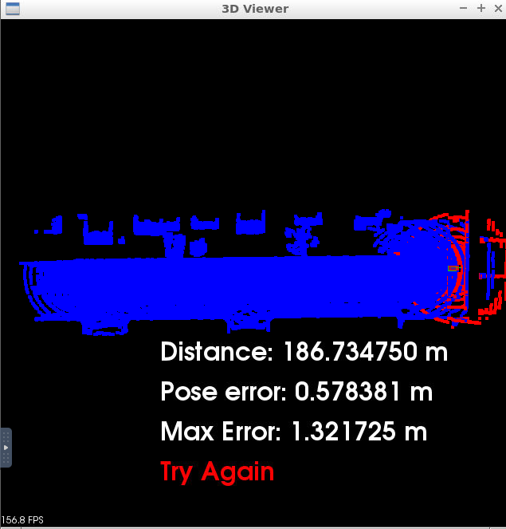
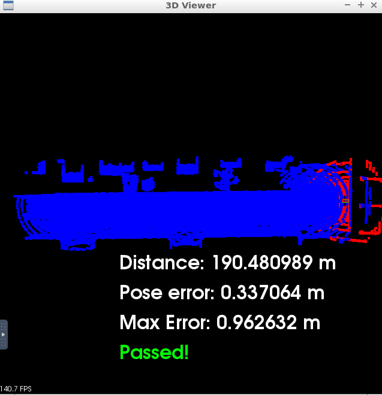
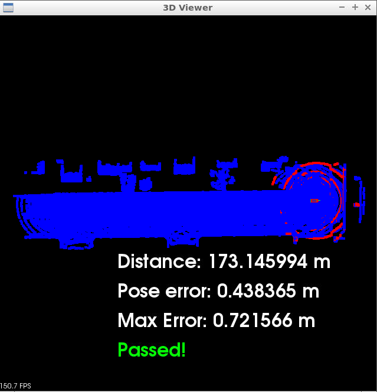
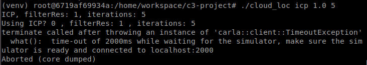

# nd013-c3-localization
The third Udacity Self-Driving Car Nanodegree Project was centered around using LiDAR to localize the simulated car using LiDAR scans at regular intervals and a provided known map. The main objective was to localize the simulated car driving for at least 170 meters from the starting position and never exceeding a distance pose error of 1.2 meters.

To achieve this, we were also tasked with implementing [Iterative Closet Point (ICP)](https://en.wikipedia.org/wiki/Iterative_closest_point) and/ or [Normal Distributions Transforms (NDT)](https://en.wikipedia.org/wiki/Normal_distributions_transform). I opted to implement both.

NOTE: I'm sure there's a way to build and run locally if you have a Ubuntu Xenial VM. However, getting everything setup for the Udacity projects has been a moot point and a lot of the libraries, etc. seem outdated. So, I opted to just use the provided workspace environment.

## Building the source
NOTE: I had trouble building the source without enabling the GPU capability. So, make sure the GPU is enabled.

From the Udacity workspace desktop, in the one terminal:

```bash
cd /home/workspace/c3-project
cmake .
make
```

## Running the simulator
In a second terminal, launch the simulator by:

```bash
su - student
cd /home/workspace/c3-project
./run-carla.sh
```

## Running the project code
In the third terminal, run the project's code:

```bash
cd /home/workspace/c3-project
./cloud_loc
```

Alternatively, I added a rudimentary command line interface where you can configure the following options:

```bash
./cloud_loc <"icp" or "ndt"> <filter resolution, float> <number of iterations, int>
```

The defaults are:

```bash
./cloud_loc "icp" 1.0 10
```

## Controlling the simulated car

To control the car, the PCL has a listener in its viewer window. To move the car, one of the five options can be selected:

| Key | Description |
----------- | ----------- |
| UP arrow | Each tap increases the throttle power by 1 tick |
| DOWN arrow | Each tap will stop the car and reste the throttle to zero, if it's moving. If it's not moving, it will apply throttle in the reverse direction |
| LEFT arrow | Incremently changes the steer angle value to the left |
| RIGHT arrow | Incremently changes the steer angle value to the right |
| A | Recenter's the camera with a top down view of the car |
| W | Each tap will increase the throttle power by 3 ticks |

The criteria for this project also specified that the car must be able to continously localize the car when it is moving at a medium speed (3 taps of the up arrow). I had some trouble getting the key presses to work. Therefore, I added an additional key option of "W".

## Results of ICP Runs

I first implemented ICP. For the first run I did, I tried a filter resolution of 1.0 and iteration of 5. However, this resulted in a failing run:



For the second run, I was able to achieve much better results with a filter resolution of 1.0 and iteration of 10:



To confirm this wasn't luck, I ran this several more times and receive a max pose error ranging from 0.821351-1.032443 --- all within the acceptable bounds.

## Results of NDT Runs

After getting a positive outcome for the ICP implementation, I added the NDT option. For it, I also kept the same filter resolution and number of iterations as my successful ICP runs (1.0 and 10). This seemed to also be the sweet spot for NDT as well as I got a better result than my ICP runs:



I ran NDT with the same options and also received a similar max pose error range.

## Additional Observations

Although in the project's instructions do indicate that when running the cloud_loc executable, you can run into segfaults. However, if you run it enough times, I'll eventually run the simulator. This is both not ideal and a bit concerning. From the error text, it seems to be caused by not being able to connect to the carla simulator properly on localhost:2000.



I'm not entirely sure why it does this because I always made sure to run the carla simulator several seconds before launching the cloud_loc executable. However, I didn't attempt to debug it further.

## Summary

Both algorithms seemed to be perform pretty well for the localhost Ubuntu Xenial runs. However, without building and running the cloud_loc and simulator with the real hardware or even a development board, it's hard to tell how accurate these particular settings and algorithms will perform.

Regardless, I was able to achieve the objective of running at medium speed (3 up arrows or 1 "W" key press) with a maximum pose error of less than 1.2 meters and 170+ meters of travel.
